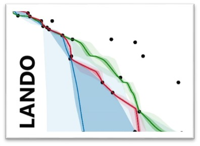

# LANDO: Linked Age-Depth Modeling

[](https://zenodo.org/badge/latestdoi/432999664)

<div align="right">
  
</div>

## About the Project

**LANDO** integrates the most commonly used age-depth modeling software into a unified multi-language Jupyter Notebook interface powered by [SoS Notebook](https://github.com/vatlab/sos-notebook). It supports:

- [_Bacon_](https://github.com/Maarten14C/rbacon) (Blaauw and Christen, 2011)
- [_Bchron_](https://github.com/andrewcparnell/Bchron) (Haslett and Parnell, 2008; Parnell et al., 2008) 
- [_clam_](https://github.com/Maarten14C/clam) (Blaauw, 2010)  
- [_hamstr_](https://github.com/EarthSystemDiagnostics/hamstr) (Dolman, 2021)  
- [_Undatable_](https://github.com/bryanlougheed/undatable) (Lougheed and Obrochta, 2019)  
 

It also supports fuzzy changepoint detection via [Holloway et al. (2021)](https://doi.org/10.1016/j.envsoft.2021.104993) to test model agreement with lithological changes.

---

## 🚀 Quickstart with Docker

You can run **LANDO** with no setup beyond Docker itself.

### ⚙️ Prerequisites

Before you can use LANDO, you'll need to install Docker and adjust its memory settings:

1. **Install Docker Desktop**  
   👉 [Download for Windows/macOS](https://www.docker.com/products/docker-desktop)  
   Follow the installation instructions for your operating system.

2. **Increase Docker Memory (Important!)**  
   LANDO requires at least **12 GB of RAM** to run the included examples smoothly.  
   - Open Docker Desktop  
   - Go to: ⚙️ Settings > Resources > Memory  
   - Drag the memory slider to **at least 12 GB**  
   - Click "Apply & Restart"

Once that’s done, you’re ready to launch LANDO!


---

### 🧪 Option 1: Run LANDO from a Local GitHub Clone (recommended)

If you cloned this GitHub repository, you can launch LANDO with one command using the built-in launcher script:

```bash
./LANDO
```

This starts Docker using Docker Compose, waits for JupyterLab to initialize, and opens it in your browser.

#### 🖥️ How to do it:

1. Open a terminal  
2. Go into the cloned folder:
   ```bash
   cd /path/to/LANDO
   ```

3. Run:
   ```bash
   ./LANDO
   ```

> 📎 If needed, make it executable: `chmod +x LANDO`  
> 🔧 You can inspect or modify the script in `launch-lando.sh`

---

### 🐳 Option 2: Run LANDO via Docker Only (no GitHub repo needed)

LANDO now includes an internal startup script, so all you need to do is:

```bash
docker run -it -p 8888:8888 gregpfalz/lando-age-depth
```

➡️ This will:
- Automatically create required folders (like `tmp_host`)
- Launch JupyterLab without requiring a token
- Open directly into the main notebook (`LANDO.ipynb`)

Then open your browser to:
[http://localhost:8888/lab/tree/LANDO.ipynb](http://localhost:8888/lab/tree/LANDO.ipynb)

> 💡 Tip: Add `--rm` to delete the container after stopping:
```bash
docker run --rm -it -p 8888:8888 gregpfalz/lando-age-depth
```
> 📝 Note: All example files and notebooks are included in the Docker image.  
> You only need to mount volumes if you want to save your work or use custom input files.

🔧 Advanced: To save work between runs, mount a local folder like so:
```bash
docker run -it -p 8888:8888 -v $(pwd)/my_data:/home/jovyan/data gregpfalz/lando-age-depth
```

---

## 📤 Uploading Your Own Data (Easiest Method)

Once LANDO is running and you’re inside the JupyterLab interface:

1. Click the **Upload** button at the top-left of the Jupyter file browser
2. Select a `.xslx` file with your data in the LANDO format from your computer
3. Your file will appear in the workspace, ready to use in the notebooks

> ⚠️ Note: files uploaded this way are *temporary*. If you stop the container, the files will be deleted. Be sure to download any outputs before exiting.

---

## 🛑 Good Practice: Shutting Down LANDO

### 📘 If You Started LANDO with `./LANDO` (Option 1 – GitHub Clone)

Just press:

```
Ctrl+C
```

in the terminal where it’s running. This will:
- Gracefully shut down the Docker container
- Clean up temporary folders (like `tmp_host`)
- Leave your local files and data intact

---

### 🐳 If You Started LANDO with `docker run` (Option 2 – Docker Only)

You have two main options:

#### ✅ Recommended: Use `--rm` for auto-cleanup

This deletes the container automatically after exit:

```bash
docker run --rm -it -p 8888:8888 gregpfalz/lando-age-depth
```

Then just close the browser tab and press `Ctrl+C` in the terminal.

#### 🧹 If You Did Not Use `--rm`

You’ll need to clean up manually:

1. First, stop the container (if it’s still running):

```bash
docker ps
docker stop <container_id>
```

2. Then remove unused containers/images:

```bash
docker container prune
docker image prune
```

> 💡 These commands remove stopped containers or dangling images. They won’t delete anything running or important.

---

### 💬 Tip: Always Download Your Results

Remember that anything **inside the container** is temporary unless you:
- Mount a folder (`-v $(pwd)/my_data:/home/jovyan/data`), or
- Manually download files from JupyterLab before shutdown


## 🔧 Built-in Language Support

| Language | Version |
|----------|--------:|
| Python   | 3.11    |
| R        | 4.3.1   |
| Octave   | 8.3.0   |

_MATLAB support is not bundled due to licensing._

---

## 🛠 Functionality

LANDO enables age-depth modeling across single and multiple cores. Input data can be supplied via CSV or PostgreSQL. Outputs include calibrated chronologies and visualizations.

| Modeling System | Key Parameters |
|-----------------|----------------|
| Bacon           | `acc.shape`, `acc.mean`, `mem.strength`, `mem.mean`, `ssize` |
| clam            | `types_curve`, `smoothness_curve`, `poly_degree_curve` |
| hamstr          | `K_fine` |
| Undatable       | `xfactor`, `bootpc` |

Call `help()` in Python cells for function documentation, e.g. `help(age_sr_plot.PlotAgeSR.plot_graph)`.

---

## License

GNU GPLv3 – See `LICENSE.txt` for details.

---

## Contact

Gregor Pfalz – [Gregor.Pfalz@aon.com](mailto:Gregor.Pfalz@aon.com)  
Bluesky: [@ClimateCompathy](https://bsky.app/profile/climatecompathy.bsky.social)  
GitHub: [https://github.com/GPawi/LANDO](https://github.com/GPawi/LANDO)
